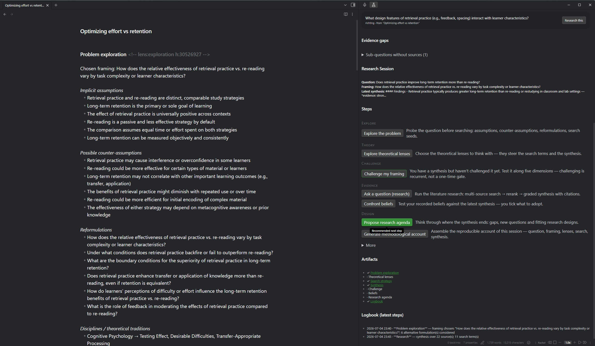
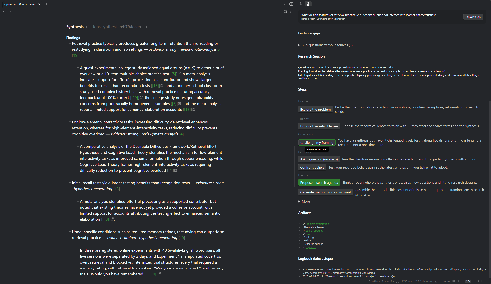

# Parallax — Research Thinking

**Think sharper before you search, weigh the evidence you find, and keep a trail of *why* you concluded what you concluded — in your own notes, in your own words.**

You know the feeling: forty papers read, a conclusion reached — and six months later you can't reconstruct why you dismissed the alternative. Or worse: an AI summarised it all so smoothly that you're no longer sure the thinking was ever yours.

Parallax is a research workbench for Obsidian built to guard exactly that. It structures the thinking that happens *before* and *around* the searching — your assumptions, your framing, the evidence and what it *cannot* answer, the beliefs you updated along the way — and records every step as artefacts in your own notes. An LLM proposes; **you decide, and you hold the pen**. Nothing is ever written over your own thinking without asking.

*(Why "Parallax"? Astronomers measure the distance of a star by looking at it from two points and watching it shift — depth comes from changing your viewpoint. Research works the same way.)*

## Get started in 60 seconds — free, no API key

1. **Install & enable**: Community plugins → search for *Parallax*.
2. Open a note and run **Quick search (single provider)**.
3. Insert real academic references from [OpenAlex](https://openalex.org) (~250M scholarly works) straight into your note — free, keyless, no account.

That's the whole entry fee. Everything beyond it is opt-in: bring any OpenAI-compatible LLM (including a fully local Ollama), or none at all.

## What a research session looks like

A session is a plain markdown note that you work step by step. A set of **copilots** helps — each one propose-only, so you tick what to adopt and can always edit anything:

1. **Explore** the problem before you search. Parallax surfaces the assumptions you're smuggling in and their counter-assumptions, competing definitions, reformulations that would change your whole research programme, and search seeds you'd never find from your original phrasing.
2. **Theory** — choose the theoretical lenses you'll think with, each grounded (*why it might apply here, what it would predict*), including the eliminative list: tempting theories that explain little.
3. **Evidence** — run multi-source literature research (OpenAlex + Semantic Scholar, rank fusion, a transparent rerank) and get a **graded** synthesis: findings labelled strong/mixed/limited, evidence tiers per study design, honest "cannot be answered with this evidence" sections, and clickable `[n]` citations. Free open-access full texts are fetched for the reading-recommendation sources when you deepen a finding.
4. **Challenge** — invite the sceptic of the suite: pushback on your framing along five dimensions, hardest against your recorded beliefs.
5. **Beliefs** — track the convictions you brought, with status and revision history, and confront them with each new synthesis. Verdicts are proposals; you tick what to adopt.
6. **Design** — turn the synthesis into a research agenda: gaps, sharper questions, fitting study designs. One click opens the next session — the loop closes.
7. **Methodological account** — walk away with the audit trail as a deliverable: question, framing (and what it was chosen over), lenses (including the eliminated ones), search strategy with its funnel, synthesis and beliefs — assembled *deterministically* from what actually happened, never written by a model about itself.

The **Parallax sidebar** is your cockpit: where you are, a recommended next step (never a straitjacket), your artefacts, the evidence gaps in your project, and source↔finding provenance. Sessions group into **projects**; everything exports as a portable, reproducible bundle (JSON + methodological account + BibTeX).

## What Parallax is *not*

Research thinking, not research answers:

- **Not a chatbot.** There is no chat window. If you want to talk to your vault, Copilot and
  Smart Connections do that well.
- **Not a reference manager.** Already using Zotero Integration or Citations? Keep them — Parallax
  never manages your library; it *feeds* it (BibTeX export from its citation register).
- **Not a PDF reader or writing tool.** PDF++ and your editor own those.

Parallax is the layer those tools don't cover: the reasoning between question and conclusion.

## Why you can trust what lands in your notes

- **Graded, not generated-and-gone.** Findings carry evidence grades and study-design tiers;
  claims resting on abstracts say so; a resolving DOI marks *existence*, never content-truth.
- **Traceable.** Finding→source links are recorded at generation time; every inserted
  reference lands in a citation register with occurrence tracking and DOI verification.
- **Yours.** Copilots propose into review screens with adopt-toggles default-off. Re-running a
  step over a section you hand-edited asks before replacing — your edits are leading.

## Privacy — what leaves your machine

| Destination | What | When |
|---|---|---|
| api.openalex.org | search queries (+ optional contact e-mail) | every search |
| api.semanticscholar.org (US) | search queries | multi-source research |
| Your LLM endpoint — api.mistral.ai (EU) **or any OpenAI-compatible URL, incl. local Ollama** | question, sub-questions, abstracts, framing, beliefs + synthesis text | AI steps only (opt-in) |
| doi.org | DOIs | verification on insert |
| Publisher/OA hosts | open-access page fetch for reading-list sources | only when deepening |
| api.consensus.app | search queries | only with the optional Consensus provider |

Keys are stored locally in your vault config and never echoed in error messages. With a local
Ollama endpoint, all LLM traffic stays on your machine. No telemetry, no account, no cloud
backend of ours.

## Install

**Community plugins** → search for *Parallax* → Install → Enable.
Manual: copy `main.js`, `manifest.json`, `styles.css` from the latest
[release](../../releases) into `.obsidian/plugins/consensus-research/`.

Works on desktop and mobile (Obsidian 1.5.0+).

## Settings that matter

- **Artifact language**: the section headings, labels and methodological account Parallax
  writes into your notes come in 13 languages (English, Nederlands, Français, Deutsch,
  Español, Português, Italiano, Русский, 中文, हिन्दी, العربية, 日本語, 한국어). The AI-written
  prose always follows the language of your question.
- **Search**: OpenAlex (default, free) · Semantic Scholar (free; optional key for a faster
  lane) · Consensus (optional, paid).
- **AI (optional)**: Mistral (EU) or any OpenAI-compatible endpoint (OpenAI, Ollama, LM Studio,
  OpenRouter). Per-step model routing and reasoning effort — spend compute where it's read.
- **Everything degrades gracefully**: no LLM key → you still get multi-source search + rank
  fusion; a dropped connection → resume re-runs only the tail; a long run shows live progress
  and a Stop button.

## Works well with

**[Voxtral Transcribe](https://github.com/maxonamission/obsidian-voxtral)** — from the same
workshop. Research thinking rarely starts at a keyboard: speak your messy problem statement on
a walk, let Voxtral turn it into a markdown note, then select the transcript and run **Explore
the problem** — Parallax picks up the thinking exactly where the recording stops. The two
plugins share the same principles (your keys, local where possible, no telemetry) but stay
deliberately separate tools: Voxtral owns capturing speech, Parallax owns the reasoning.

## Support

Parallax is free and GPL-3.0. If it sharpens your research, you can
[**buy me a coffee** ☕](https://buymeacoffee.com/maxonamission) — it keeps the work going.

Issues and ideas: [GitHub issues](../../issues). Development happens in the
[automations](https://github.com/maxonamission/automations) repo; this repo carries releases.

## License

[GPL-3.0](LICENSE) — © 2026 Max Kloosterman
